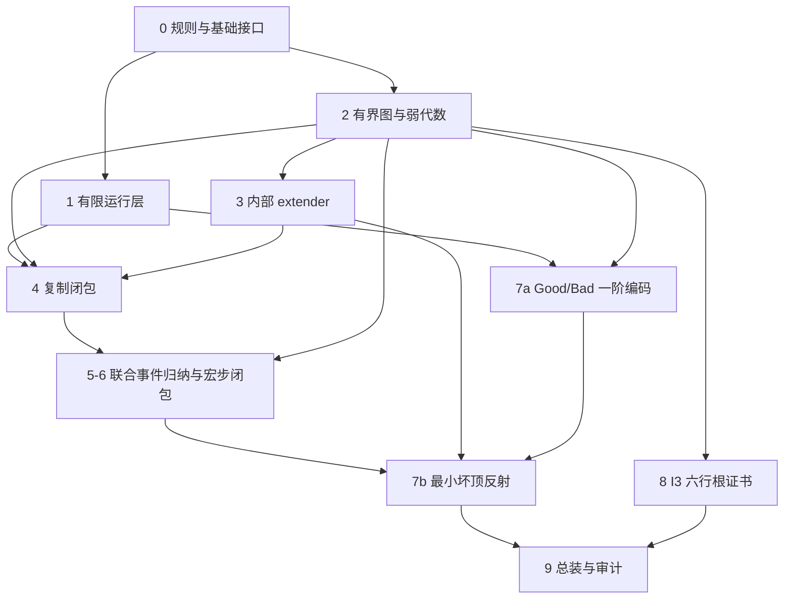

# 原 IBLP 指定六行根：证明解析与 Lean 形式化分阶段计划

> 完成更新（2026-09-13）：主目标 `I3 → Acc Child root` 已全部形式化并通过完整验证。实现与阶段对照见 [完成报告](../COMPLETION_REPORT.zh.md) 和 [阶段完成表](../WORK_ITEMS.md)。阶段 7 采用固定子图案的完整实现存在公式与外部最小坏顶反射，替代统一 `BadCode`/`MinBadCode` 总装。以下保留原始规划记录。

日期：2026-09-12。状态：原文研究与工作规划完成；尚未实现或通过内核验证本 IBLP 定理。

研究对象：[IBLP_wellfoundedness_zh.pdf](C:/Users/17857/Desktop/IBLP_wellfoundedness_zh.pdf)，14 页，稿件日期 2026-09-11。SHA256：`6218983d5e52f4fc8cda17c3376aa813e29150902dcd88a2e2cd0d7cf687bf2c`。

本计划已通读全文并逐页检查公式；另对照工作区保存的四页原始定义和相关 Lean 源码。以下“待证”“验收”均指未来实施要求，不表示已有证明。文档中的拟议模块名和定理名尚未建立，也未编译。

## 1. 应当交付什么定理

主目标严格对应稿件定理 1.1：**在 I3 假设下，原 IBLP 规则从指定六行根出发不存在无限非零展开序列。**

将行按递增列保存，根是：

| 行 | 圆圈列 | 步长 | 标记 | p | e |
|---|---|---:|---|---:|---:|
| 1 | (0,1) | 1 | 空 | 0 | 1 |
| 2 | (0,1,2) | 1 | 空 | 1 | 2 |
| 3 | (0,1,2,3) | 2 | 空 | 1 | 2 |
| 4 | (2,3,4) | 1 | 空 | 3 | 4 |
| 5 | (2,3,4,5) | 2 | 空 | 3 | 4 |
| 6 | (4,5,6) | 1 | 空 | 5 | 6 |

拟提供三个等价或直接相关的出口：

1. `i3_root_accessible`：`I3 → Acc Child root`，约定 `Child Q P` 表示 Q 是 P 的一次原展开结果。
2. `i3_reachable_step_wellFounded`：在由原规则生成的可达图案子类型上，`Child` 良基。
3. `i3_no_infinite_expansion`：不存在从 root 出发的自然数参数序列和无限非零展开序列。

其中 `Reachable` 必须只由字面运行规则定义，不能通过“存在有界实现”筛选节点。I3 必须是非平凡初等自嵌入 `j : V_λ → V_λ` 的原意；采用临界点或临界序列正规形式时，要证明与原陈述的衔接。

**范围区别：**四页定义稿的 Definitions 4–5 还定义了行键和图案的字典序比较。展开树良基并不自动证明该比较序在可达域上是良序。原文没有建立这座桥，本轮主线也不把它计作已覆盖。如以后要求比较序良序，需要另证比较关系的正确性、键是否足以识别带标记图案，以及比较下降与展开可达性的桥接。也不在本任务中计算该根的具体序数值。

## 2. 证明实际上如何闭合

### 2.1 有限证书承载语义

完成态 P 的证书由模型 M 内的有限不可达点序列 `θ₀ < … < θₙ < θₙ₊₁ = Θ`、每行的集合映射，以及各标记的弱相等组成。第 r 行保存的是：

`K_r : V^M_(θ_{e(r)}+1) → V^M_(θ_{r+1}+1)`。

这里 `θ_{e(r)}+1` 是序数后继，`θ_{r+1}` 中的 `r+1` 是点序列下标，编码时必须区分。证书还包括行型、proper 标记、准确 p 输送和完成态饱和性 `q(e(r)) ≤ p(r)`。没有包含未来所有展开的正确性或树的良基性。

### 2.2 复制改变所在模型

末行有界图导出内部秩 extender。引理 4.1 构造 `I : M → N`，并证明：外部良基；N 对外部可数序列封闭；`I` 在保存的整个 `V^M_(α+1)` 上恰等于 K；`V^N_β = V^M_β`。这些性质允许旧前缀图留在 N，而复制行使用 `I(K_r)`。

连续复制任意有限 m 次只需要有限次内部超幂。必须逐次构造中间模型，证明后继 extender 是前一 extender 的内部像；不需要无限迭代的直极限定理。

### 2.3 等宽把一个检查点升级为整包容量

同一轮复制产生的旧顶点有稳定入口标签和所属块。实际能读取非空记录的旧标记，其全部非终输送因子来自同一复制块。

引理 6.1 从更早标记事件恢复记录的精确来源；定理 6.2 说明同块同一 p 链分量的非空记录与分量种子等长。于是原规则只检查 `v+1 ∈ A_u`，就能推出长度 h 的整个家族都存在，并给出每个 j 的实际输送链：

`b+j → u_{ν−1}+j → … → t+j → s_j`。

“记录等长”仍不足以单独证明插入合法。随后还要用有界弱语义证明左包、右包各在正确间隙中，旧列与两包互不重叠，新增步边正确。排序去重因而不会改变预期的 `+2h` 列数和 `+h` 步长。

### 2.4 最小坏顶界通过一次宏步产生矛盾

在环境宇宙中，取具有可达坏图案有界实现的最小顶界 Θ。坏分支由一个实数 x 编码。

若第一步只是 cut，直接得到更小顶界 `θ_n < Θ`。否则，完成有限复制后，在目标模型 N 中构造子图案的证书，其顶界是：

`Θ′ = I_m(θ_n) < I_m(Θ)`。

关键不在于 `Θ′ < Θ`；原文并未主张这个通常不成立的不等式。初等性将“Θ 是最小坏顶界”的一阶陈述送到 N，变成“`I_m(Θ)` 是最小坏顶界”。嵌入固定实数 x，N 仍看到同一个坏分支的尾部，而新证书低于 `I_m(Θ)`，得到矛盾。

### 2.5 I3 只负责给根提供起始证书

用临界序列 `κ_i` 和 application 构造根所需六个 owner，再分别限制到各行的源秩层。根没有标记，初始弱相等义务为空。取 `Θ = κ₇` 即可接入上述一般有界实现定理。

## 3. 实现架构与现有代码的复用边界

建议使用新的 `IBLP` 命名空间和独立项目目录，例如 `work/iblp-wellfoundedness`。本轮只写规划，没有创建这个 Lean 项目。

### 3.1 三层结构

| 层 | 保存内容 | 不应混入的东西 |
|---|---|---|
| 字面运行层 | 行数组、步长、marks、部分复制、有限扫描、原展开与可达性 | 大基数、语义证书、将待证不变量变成执行过滤条件 |
| 有界证书层 | 模型内秩层、集合图、弱作用、历史资料、单步局部闭包 | 未来所有展开正确、树已良基、未构造的 extender 存在性 |
| 集合论与总装层 | 内部超幂、公式编码、反射、I3 根实现 | 隐藏 I2、共同全域 owner、无限迭代良基性的附加假设 |

运行状态与证明辅助资料分开：入口标签、来源、历史图和族身份可以用于证明，但最终忘却这些资料后的输出必须等于原始数值算法的实际结果。

### 3.2 当前可查到的基础

本轮读取的 FullMarkedBLP 工作树 HEAD 为 `832af28724c9897dfaf56248de662aee7b5a9b79`，工作树无未提交改动；配置固定 Lean/Mathlib `v4.30.0`。RankElementarity 工作树 HEAD 为 `026f360d90bbd538a39f152d051b2b9b54227240`，它的配置依赖 FullMarkedBLP 的 `b30d35a…`。这些不是同一基点；实施时必须锁定一致的依赖图。本轮未重新构建这些项目。

| 任务 | 已检查的源码入口 | 使用方式与限制 |
|---|---|---|
| 秩集合、序数、一阶初等映射 | Mathlib `SetTheory/ZFC/{Basic,Ordinal,Rank,VonNeumann}.lean`、`ModelTheory/ElementaryMaps.lean` | 可作为基础；需要补 M 内部秩层与集合图之间的桥 |
| application 的初等性和合成恒等式 | FullMarkedBLP `RankApplication.lean`：`rankApply`、`rankApply_comp` | 是实际实现，适合根构造；不等同于任意两秩间的有界图接口 |
| application 临界点与临界序列不可达性 | `RankApplicationCritical.lean`、`RankCriticalSequenceInaccessible.lean` | 核对假设和不可达序数/基数之间的桥后复用 |
| 公式相对化和集合满足关系 | RankReflection `FormulaRelativization.lean`、`SetSatisfaction.lean`、`ElementaryInclusionFormula.lean` | 复用编码方法；现成入口主要针对极限秩和包含映射，需要推广到后继秩、任意图及内部模型 |
| 有限数组、q 阶梯、平移、冻结扫描 | FullMarkedBLP `Native.lean`、`Shift.lean`、`TraceCompute.lean`、`Scan.lean` | 可移植纯组合引理；须先证明新旧数据约定的对应 |
| 弱相等读取序数边 | `WeakAgreementEdges.lean` | 抽象的初段区分论证可复用；输入界与新的全输入弱作用必须核对 |
| Łoś 定理 | Mathlib `ModelTheory/Ultraproducts.lean`，`FirstOrder.Language.Ultraproduct.sentence_realize` | 普通类型结构的超积。不能直接充当 M 内部 extender 超幂、传递坍缩或完整有界一致性定理 |
| 内部秩 extender、可数封闭、集合式坍缩 | 本轮在 FullMarkedBLP、RankElementarity、YesMetaZFC、YesMetaZFC-stage4、BMSConstructibleBridge 相关源码及 Mathlib 集合论范围检索 | 未找到满足引理 4.1 全部结论的现成实现；作为新增工作预算，不据此宣称所有公共库均无此定理 |

特别不能原样导入旧项目的 `Syntax.zero`、`start`、`Copy.shortCopy`、`mStar`、`Step`、`RankI2` 或最终良序定理。旧零项有两行，旧根有五行，复制与生成规则也不同；本证明零项为零行，根为上述六行，使用全尾复制。

本计划默认最终交付 Lean/Mathlib 集合语义中的 `I3 → 原展开树良基`。若另外要求纯一阶证明对象 `ZFC ⊢ I3 → WF`，还需独立的对象级推导工程。不能把 Lean 语义定理、公理审计和一阶 ZFC 演绎证明称为同一件事。

## 4. 阶段总表

阶段编号表示验收包，实际执行次序见第 6 节。第 6 阶段是第 5 阶段按事件推进的闭包收口，不是两次互相借用最终结论的独立归纳。

| 阶段 | 核心产物 | 依赖 | 完成标准 | 风险 |
|---|---|---|---|---|
| 0 语义锁定与技术试探 | 原规则对照、最终类型、内部模型与图接口、难点清单 | 原稿 | 无规则替换、无附加数学假设；三个试探方向可具体表述 | 高 |
| 1 原 IBLP 有限机器 | 原始数组、准确输送、全尾复制、native、冻结扫描、展开 | 0 | 一轮操作的终止性、规范对应和可达域全定义性义务明确 | 中高 |
| 2 有界图与弱作用 | K#、ρ、有限词、自然界、全输入等价、限制代数 | 0 | 原文 (3.6)–(3.14) 分别有精确引理 | 高 |
| 3 内部 extender | 引理 4.1 的完整构造与可有限重复接口 | 0、2 的有界图接口 | 超滤、Łoś、良基、封闭、全域一致性、内部性全部闭合 | 极高 |
| 4 复制闭包 | 合法性保持、模型更新、三种标记来源及弱证书 | 1–3 | 所有被保留标记正确，包括不活动交叉标记 | 高 |
| 5 扫描事件骨架与等宽 | 入口标签、来源、分量种子、精确继承、整包容量 | 1、4；先前事件不变量 | 引理 6.1、定理 6.2 和 (6.5)–(6.6)，带严格事件顺序 | 极高 |
| 6 补全事件语义与宏步闭包 | native 限制图、包新鲜性、步边、弱证书、饱和性 | 2、4、5 的当前事件结论 | 联合事件归纳关闭；实际展开输出有证书且满足 (8.1) | 极高 |
| 7 一阶编码与最小坏顶反射 | Good、Bad、最小性公式、实数固定、一般良基定理 | 1、3、6；编码可提前 | 不再留下“公式可表达”或“反射成立”的抽象假设 | 极高 |
| 8 I3 六行根实现 | 临界序列、六个 owner、集合图、根证书 | 0、2；独立于 3–7 主体 | 仅从原 I3 得到根的全部有限证书 | 中高 |
| 9 总装、语义与内核审计 | 三个最终出口、完整构建、依赖审计、对应表 | 1–8 | 原规则、原根、I3 范围、全部关键引理均内核闭合 | 中 |

## 5. 每阶段的具体工作包

### 阶段 0：先把要证明的对象固定下来

**0.1 原规则对应表。**逐项对应四页定义稿 Definitions 1–15 与正文第 2 节。重点记录：原定义步长使用自然数，本文可达域证明正步长；准确 trace 的原数组包含终点 δ，而正文 (2.4) 显示的是非终因子；后继图案的统一参数接口按正文解释为同一 cut 边；高位筛选的“下一源列”索引在 proper 条件下合法。

**0.2 分开语法与不变量。**用原始 `Row` / `Pattern` 表示字面数据；另定义 `BasicValid`、`OrdinaryShape`、`ProperMarks`、`ExactTransfers`、`Saturated`。不能把 (2.2)、(2.3) 或饱和性作为新过滤器植入 `expand`。

**0.3 锁定模型表示。**明确环境集合、模型内部集合、内部函数图、内部秩层、外部可数封闭性的类型。建议环境从 `ZFSet` 开始，以传递的模型域和内部集合成员资格描述迭代内模型。各中间模型必须实际构造，不能留作额外存在性前提。

**0.4 三个早期试探。**先写清并检查下列目标的类型和证明路线：

- 一份 K 的图如何导出 M 内部的超滤系统，全部测试集为何在 `V^M_(α+1)`；
- 两个后继秩集合结构间的初等性如何成为一个纯集合论公式；
- 六行根 owner 的有界限制如何得到真正的相对初等图。

**产物：**`SPEC_LOCK.md`、`DEPENDENCIES.md`、拟议 `Foundations/Model.lean` 接口设计。**验收：**逐项能指出定义来源；识别未证接口；不以添加 closure/transfer 公理来让顶层假装闭合。

### 阶段 1：实现与原定义一致的有限运行规则

建议模块组：`Syntax`、`Pointers`、`Trace`、`RawCopy`、`Native`、`MarkCompletion`、`Scan`、`Expansion`、`Reachability`。

1. 一基行号与零基数组位置转换；安全访问 `p/e/q`；证明 `p(r)<e(r)≤r`、`q(r)<r`。
2. `trace` 反复取 p，精确到达 δ 才成功；证明严格下降、唯一性、底因子识别和算法/关系等价。
3. `rawCopy : Pattern → Option Pattern` 完全按照 (2.5) 和三类 marks 筛选；保留前缀 `1…n−1`，复制源 `p…n`。
4. 分开“复制 m 次”“cut”“从入口 n 扫描”三个操作，避免把每次 raw copy 后都补全。
5. 阶梯沿 q 而非 p 取点；不替换为整个整数区间。native 下移的两个删除对象都从删除前行选定，中行第一次下移保留 e、保持步长。
6. 当前行的旧 marks 按升序冻结；每次检查读当前状态；新 marks 不进入本次队列。已有记录严格来自已处理旧行。
7. 单轮终止证明使用剩余入口旧行数及剩余冻结事件数。native 虽增加行数，扫描仍跳过整个新家族。trace/native 内部用严格下降或有证明的 fuel，不能任意截断。
8. `E(P,0)`、后继、首次复制失败回退分别覆盖；证明首次合法蕴含以后有限次复制合法。原定义没有的“以后复制失败则 cut”不能作为总化捷径。
9. 证明完成态可达输入上算法确有输出，并将部分实现/错误分支从最终可达域定理中消去。基础总化义务可先在明确的组合条件下证明，条件由后续闭包归纳统一回填。

**有限回归样例：**空图案、单行后继、首次失败回退、无记录跳过、内部检查失败、低/高交叉筛选边界、非空中行第一次下移、源包与旧列相邻、冻结过程中新增 mark、跨家族重编号、参数 0/1/2。样例只验证算法对照，不承担良基性证明。

**验收：**`expand` 的实际代码与规范关系双向对应；所有停止依据来自局部有限性，没有用全局 IBLP 良基性定义自身。

### 阶段 2：把弱作用代数做成独立基础库

建议模块组：`BoundedGraph`、`WeakAction`、`WordAction`、`WeakAgreement`、`Restriction`、`Realization`。

1. 有界图包含内部存在性、函数性、源/目标秩结构、初等性、临界点及端点值。保存域为 `V_(α+1)`，不是 `V_α`。
2. 定义 `K#(z)=K(z∩V_α)`、`ρ_K(η)=K(min(α,η))`，证明截断输入属于域。
3. 分别证明截断交换 (3.6)、单图限制 (3.7)、词秩作用与膨胀估计 (3.8)。一般弱作用词与由准确输送组成的可合成初等映射词分开处理。
4. 证明同时限制公式 (3.9)，并计算精确新自然界 (3.10)；保留界相等的边界情形。
5. 证明极限界 D 处“受限 x,z 输入”与“任意内部 z 的输出截断相等”双向等价 (3.11)。注明有限词非空/恒等词约定与自然界适用条件。
6. 证明右合成、左合成、缩小双方保存域的弱相等规则；每条显式记录最终允许的截断界。
7. 从准确 p 链构造真正的有界复合 W，证明复合所需域包含关系、`W(θ_δ)=θ_b`、`θ_b<Δ≤θ_(b+1)` 和 Δ 的内部不可达性。
8. 建立弱相等读取实际序数值的引理，允许输入 z 不在原受限输入界内；先调用第 5 项的全输入等价。

**验收：**第 5、7 节以后不再展开集合交并的基础证明，只调用这些明确界限的引理。旧库的 `extendRankMap` 域外恒等约定不能替代本文的规范截断算子 K#。

### 阶段 3：把引理 4.1 拆成八个不能省略的成果

建议模块组：`Extender/Coding`、`DerivedSystem`、`InternalUltrapower`、`Los`、`CountableCompleteness`、`Collapse`、`Agreement`、`FiniteIteration`。

**3.1 秩内编码。**建立有限元组、序偶、投影、统一解码以及关系 `S⊆ω×U` 的编码。逐项证明编码后落在 U 或 `P^M(U)`；不对可能超出保存域的外部序列直接应用 K。

**3.2 派生系统。**从 K 定义 `E_a={X∈M : X⊆U^|a| ∧ a∈K(X)}`，证明 M 内部超滤性质与投影相容性，及整个 E 是 M 中的集合。注意 E_a 首先作用于 M 拥有的子集代数，不能直接冒充作用于所有外部子集的 Mathlib `Ultrafilter`。

**3.3 商结构与 Łoś。**代表必须是 M 中的函数图；定义等价、成员关系和投影不变性，证明逐公式 Łoś 与常值映射初等性。对存在量词构造内部代表时，应使用 M 的选择/替换能力。

**3.4 外部良基。**由 M 的外部可数封闭性把代表及种子序列放回 M；用 β 的内部正则性合并可数种子；将可数测试族编码为 S，证明共同大集非空，再排除成员下降。

**3.5 传递坍缩。**除良基外，还要证明外延性及每个成员前驱族可由集合承载，解决类规模超幂的 universe/smallness 问题。构造坍缩后的 N 与 I，而不是仅声明它们存在。

**3.6 可数封闭。**给定 N 元素的任意外部可数序列，选择代表、合并种子、在 M 内构造序列值函数，证明其像正是原序列的内部编码。

**3.7 完整有界一致性。**先构造 `V^M_β` 的种子副本，证明没有额外成员；再证明对每个内部 `x⊆U`，`I(x)=K(x)`。目标覆盖整个 `V^M_(α+1)`，不能只验证有限 θ 点或只覆盖 `V_α`。

**3.8 内部性与有限重复。**证明 M 自身的超幂良基论证和坍缩与外部一致，得到 `N⊆M`、`V^N_β=V^M_β`；证明 derive/collapse 所用定义可在初等像下比较。由此用 Nat 归纳建立任意有限 m 次的模型、复合映射和全套不变量。

**验收：**引理 4.1 的全部结论都由 K 和明示的模型性质推出。M 的传递性、ZFC 与可数封闭性在环境起点及每个迭代后继均有实例证明；最终没有 `ExtenderExists` 或 `UltrapowerWellFounded` 的额外假设。

### 阶段 4：原复制的组合与语义闭包

1. 证明点映射在所有所需列上严格递增，边界 `f(p)=n` 的新旧点赋值一致，复制行使用 `I(K_r)`。
2. 旧前缀图的秩严格小于 Θ，因此属于 N；其源/目标秩层在 M、N 中相同。只使用已证的 `V^N_Θ=V^M_Θ`，不擅自扩大到 `V_(Θ+1)`。
3. 从普通行型证明下一控制行最小点不低于当前 p，逐列核对下一次复制定义性。
4. 全复制：精确输送逐因子取像，弱界同步取像。
5. 低位交叉：保留后缀的自然界不超过临界点；显式处理等于临界点的情况，不能写 `I(κ)=κ`。
6. 高位交叉：从原筛选推出下一源列界；证明新准确词恰为 `(IU)TV`。分别证明 (5.6) 的三个上界都覆盖新自然界，才能应用 (5.5)。
7. 对每个保留 mark 构造来源标签，证明底因子在全复制时随块移动，交叉后仍在初始不扫描前缀。

**验收：**一次 raw copy 及任意有限 raw copies 的全部证书正确。复制后只携带本阶段实际能保持的条件；完整饱和性由补全阶段恢复，不能误称 raw copy 本身保持整个完成态。

### 阶段 5：入口标签、精确继承与分量等宽

建议模块组：`Scan/EntryLabels`、`History`、`Origins`、`Components`、`Inheritance`、`EqualWidth`、`ParallelTransport`。

1. 稳定区分 `EntryVertex` 与当前自然数行号；建立严格递增的当前位置映射及插行更新公式。证明辅助标签忘却后仍是原算法输出。
2. 证明 (6.1) 的块划分、全复制来源以及交叉底因子在本轮始终不能读取记录。来源断言逐 mark 陈述，不断言一整行仅含全复制 marks。
3. 定义入口 `p₀/e₀/q₀`，证明同块时的条件饱和性 (6.2)。底因子 p 已离块时不套用这个结论。
4. 沿严格下降的入口 p₀ 链定义分量种子 σ；证明离块不返回、同链同种子及递归终止。
5. 在“严格更早事件正确”的归纳假设下，证明引理 6.1：记录非空迫使 `e₀(u)` 的旧 mark v 此前成功，并给出精确连续记录和读取来源 z。
6. 对已处理旧顶点证明定理 6.2：种子记录非空且等长。结论只涉及同块同分量的非空记录，不推广为所有块/所有顶点等宽。
7. 当前标记的单点 guard 逐因子推出记录非空，再由等宽得到 (6.5)，最终逐个 j 构造 (6.6) 的准确新输送。

**验收：**得到的是实际当前行号上的连续列表和家族容量，不是抽象序数区间足够大。每次用到的标记正确性均有事件编号严格下降的证据。

### 阶段 6：联合事件归纳与完成态闭包

建议模块组：`Native/Realization`、`Mark/PacketGap`、`PositionShift`、`Certificates`、`Scan/Invariant`、`ExpansionClosure`。

**原生事件：**先从阶梯范围证明新序数 `ξ_j=K(θ_{s_j})` 严格位于旧基点与隐含端点之间、内部不可达。把各家族图明确取为同一个 K 的相应秩限制，核对中行例外。证明新直接 mark、旧 mark 的限制词证书及最低旧行的 p/q 保持。

**标记事件：**利用历史 carrier 与自然界，先以序数成员测试证明 (7.5) 的左包间隙；再结合阶段 5 的精确平行列表和全输入弱相等得到 (7.6)，从而证明右包间隙。之后才使用无重复插入的数组位置计算，推出长度、步长、p/e 和旧配对源保持。

**弱证书与饱和性：**每个新 mark 的历史词同时限制到各新家族图，使用 (3.9) 构造新弱证书；逐行恢复普通行型、proper 条件和 `q(e(r))≤p(r)`。证明未扫描旧前缀不变、已经完成的低行不会被后续事件破坏。

**联合归纳的顺序必须是：**

`此前事件全部正确 → 当前继承/等宽/容量 → 当前间隙与新边 → 当前弱证书与位置保持 → 推进到下一事件`。

为 native 事件设置独立分支；它只使用本行 marks 已完成的结果。可按固定入口旧行序号及行内冻结事件位置组织有限事件归纳。阶段 5 中引理可以对此前不变量参数化，阶段 6 的总归纳必须实际构造该不变量，不能把它遗留在最终定理前提中。

**宏步验收：**在实际子图案输出上构造新证书；有复制时得到 `Θ′=I_m(θ_n)<I_m(Θ)`，cut/后继/回退时得到 `Θ′=θ_n<Θ`。新末行图确在目标模型内，因此下一轮无需额外寻找实现。

### 阶段 7：把“可表达”真正变成公式并完成反射

建议模块组：`Coding/FinitePatterns`、`ExpansionFormula`、`SetSatisfaction`、`GoodFormula`、`BranchReal`、`MinimalBadTop`、`WellFounded`。

1. 将有限图案、参数、扫描状态和有限运行轨迹编码为自然数/遗传有限集合；证明解码、运行检查的正确性与绝对性。可达性由有限历史见证。
2. 构造内部集合结构的满足关系及其正确性，覆盖 `V^M_(α+1)` 等后继秩，不要求这些小秩层自身满足 ZFC。
3. 将“某集合图是这两个集合结构间的初等映射”编码为一个一阶公式。不能以外部无限公式族的逐条保持代替这个单一公式，因为第 8 节需要一次输送整个最小性陈述。
4. 定义 `GoodCode(R,P,Θ)` 并证明与第 3 节的实际有限证书及可达性双向对应。Good 不量化一个额外外部模型，不包含可数封闭、真类嵌入或 WF；在 M 中的解释自然使用 M 自己的秩层。
5. `BadCode(P)` 用存在实数编码无限参数及非零节点序列定义。证明给定 x 的算术核查绝对性、分支尾部仍坏。
6. 证明临界点大于 ω 的嵌入固定自然数、有限图案代码和实数；由 `I(x)=x∈N` 得到分支实数确在目标模型中。这里不用“坏分支存在性对所有内模型无条件绝对”。
7. 从一个坏证书开始，在有界候选序数集合内选最小 Θ，得到完整的一阶 `MinBadCode(R,Θ)`。避免把全体序数组成集合，也不用全局类选择。
8. 由初等性输送 `MinBadCode`，用阶段 6 的实际证书、同一个分支尾部和严格不等式产生矛盾。先证“有环境有界实现的根无坏分支”，再转为 `Acc`。

**验收：**`GoodCode`、`BadCode`、`MinBadCode` 有实际公式与语义正确性定理；`map_formula` 使用的就是该公式。最终证明没有将“可表达性”“最小性可传递”做成调用者必须提供的假设。

### 阶段 8：独立完成六行根的 I3 证书

该阶段无需等待 extender 与组合主线全部完成，适合作为早期完整里程碑。

1. 从原 I3 提取临界点及足够大的极限秩，证明临界序列点严格递增、不可达且所用后继秩仍在 λ 以下。若采用 λ 为临界序列上确界，证明正规化步骤。
2. 定义普通合成幂 `j^s` 与 `g_s=Apply(j^s,j)`，明确区分普通合成与 application。
3. 证明 `g_s ∘ j^s=j^(s+1)`、`crit(g_s)=κ_s`，据此推出 `g_s(κ_i)=κ_(i+1)`（i≥s）。
4. 六个 owner 依次是 `j, j, j∘j, g₂, g₂∘g₂, g₄`。分别限制到源端点指标 `1,2,2,4,4,6` 加一的秩层，目标隐含端点指标为 `2,3,4,5,6,7`。
5. 用公式相对化证明这些限制在对应两个秩结构间初等，构造其集合图并检查秩界；一般“限制一个初等映射”并不足以自动得到所需相对初等性。
6. 检查所有显式步边、隐含末边、临界点和根饱和性；根 marks 全为空。最后给出 `exists_root_boundedRealization_of_i3`。

**验收：**定理唯一大基数前提是原 I3；没有调用带 `RankSigmaTwoElementary` 或 `RankI2` 参数的根族定理。

### 阶段 9：总装与交付验收

1. 由阶段 8 根证书与阶段 7 一般定理得到根 `Acc`，再证明可达域良基和不存在无限参数展开序列。
2. 对原运行定义、root、zero、marks 筛选、native 例外和 Step 关系做逐项语义对照。核对 relation 方向以及展开历史树与字面状态关系的转换。
3. 独立打印最终定理的完整类型、所有隐式假设与 universe 参数；审计承载模型/证书的结构字段，防止关键结论藏入字段。
4. 固定工具链和依赖提交，从没有本项目旧编译产物的环境完成全部目标构建；明确区分干净项目构建与依赖缓存复用。
5. 在构建环境中遍历主定理与项目定理的传递公理依赖；允许的逻辑基础按既有项目口径为 `propext`、`Classical.choice`、`Quot.sound`，拒绝 `sorryAx` 和自定义未证明公理。I3 应作为定理假设出现。
6. 源码扫描作为辅助检查，不能替代内核依赖审计；不以 `native_decide` 或外部运行结果承担关键证明。
7. 保存 `CheckMainTheorem.lean`、`Audit.lean`、构建日志、语义对应表和剩余限制说明。仅当所有依赖都闭合后称为“该 IBLP 定理完成形式化”。

## 6. 推荐执行次序与关键路径

不建议按 PDF 从第 2 节一直写到第 9 节才发现基础接口不合用。

**第一批：**阶段 0；建立最小有界图接口；重点试探阶段 3 的内部超滤与坍缩表示、阶段 7 的后继秩满足关系、阶段 8 的根限制图。此时应暴露基础层的真实缺口。

**第二批：**完成阶段 1 的有限运行层和阶段 2 的弱代数；尽早把阶段 8 做成独立闭合结果。若引理 4.1 长期未闭合，也要把“根证书已完成”和“全局良基性未完成”分开报告。

**第三批：**集中完成阶段 3，再完成阶段 4 的复制来源与弱证书。编码层可在此期间独立推进；这里的独立性是工作依赖关系，不预设多 agent 执行。

**第四批：**按阶段 5–6 的联合事件归纳攻克补全。继承、等宽、平行输送、间隙、新弱证书逐项验收，再关闭单轮宏步定理。

**第五批：**完成阶段 7 反射，用阶段 8 收口，最后阶段 9 全面审计。

决定总周期的主线是 **内部 extender → 全部复制标记证书 → 联合扫描闭包 → 一阶最小坏顶反射**。根实现和基本数组编码不宜成为衡量整个任务已完成比例的主要依据。

目前不承诺精确天数、代码行数或 token 数：内部模型表示、后继秩满足关系与引理 4.1 尚未做编译试探，给固定工期缺少依据。阶段 0 完成后，可以根据实际缺口重新估计；每次进展应报告已闭合的具体引理和仍开放的依赖。

## 7. 必须保留的风险记录

| 风险点 | 容易产生的错误 | 正确的验收证据 |
|---|---|---|
| 内外部子集 | 把 E_a 当成所有外部子集上的超滤 | 明确 M 内部子集代数和全部内部函数代表 |
| 类规模坍缩 | 仅证无无限下降就直接套集合坍缩 | 外延性、集合式成员前驱和大小控制 |
| 有界一致性 | 只检查 θ 点，或漏掉源端点层 | 对全部 `x∈V^M_(α+1)` 的等式 |
| 原生限制 | 假定任意初等图的任意限制仍初等 | 源目标秩相对化与端点计算 |
| 满足关系 | 把“Lean 中的 Prop”当作可输送的一阶公式 | 单一纯成员公式及其双向语义桥 |
| 后继秩 | 套用只支持极限秩的现有 truth 接口 | `α+1`、`β+1` 的实际结构满足关系 |
| 等宽循环 | 先假定当前包正确来证明当前容量 | 所有调用指向更早事件的归纳证明 |
| 数值标签 | 插行后仍使用旧数字追踪来源 | 入口标签/当前坐标映射及忘却一致性 |
| 分量边界 | 把整个块或所有复制块都视为等宽 | 同块同种子且记录非空的精确量词 |
| 不活动 marks | 只证明当前会执行的 marks | 三种来源的所有保留证书都闭合 |
| 错误下降 | 要求每步 `Θ′<Θ` | 目标模型中的 `Θ′<I_m(Θ)` 与最小性输送 |
| 坏分支 | 假定内模型自动拥有外部坏分支 | 同一个实数被 I 固定且属于 N |
| 隐藏加强 | 用 I2、共同 owner 或无限迭代定理补缺 | 最终完整类型只保留原 I3 与逻辑基础 |
| 主结论扩张 | 将树良基报告成原键序已良序 | 出口逐字对应定理 1.1；比较序另设任务 |

这些是需要显式展开的证明义务。本轮没有据此判定稿件错误，也没有把纸面论证判定为已获机械验证。当前判断是：主线和局部接口可以明确拆解，最不确定的工程量集中于第 4 节与第 8 节的集合论基础，以及第 6–7 节的联合归纳。

## 8. 本轮核查来源与后续起点

- 主稿：[14 页中文证明](C:/Users/17857/Desktop/IBLP_wellfoundedness_zh.pdf)。规则在第 2–3 页，弱代数第 4–5 页，extender 第 5–6 页，复制第 6–8 页，等宽第 8–10 页，补全第 10–12 页，反射第 12–13 页，根实现第 13–14 页。
- 原定义：[Infinite Basic Laver Patterns (IBLP): a formal specification](<C:/Users/17857/Documents/Codex/2026-07-24/zhe/work/basic-laver-pattern-reference/definitions of iblp.pdf>)。对照 Definitions 1–15；Definitions 4–5 是另一个需要单独处理的比较关系。
- [Dougherty, Critical points in an algebra of elementary embeddings, II](https://arxiv.org/abs/math/9503204)，已下载并核查第 1–2 页：application 定义、保持初等性、`a∘b=a(b)∘a` 和 application 临界点公式支持阶段 8 的文献依赖。这里是有限根构造的基础，不是 IBLP 全局良基性的外部定理。
- 主稿列出的 Goldberg 文献在本文中并非逻辑依赖；本轮没有将其中的 extender 次序定理列为已可调用的前提，也未独立核查该作者稿。
- 现有项目：[FullMarkedBLP 语义说明](C:/Users/17857/Documents/Codex/2026-07-24/zhe/work/full-marked-blp/SEMANTIC_REVIEW.md)、[application 实现](C:/Users/17857/Documents/Codex/2026-07-24/zhe/work/full-marked-blp/FullMarkedBLP/RankApplication.lean)、[RankReflection 集合满足关系](C:/Users/17857/Documents/Codex/2026-07-24/zhe/work/rank-elementarity/RankReflection/SetSatisfaction.lean)、[Mathlib Łoś 定理](C:/Users/17857/Documents/Codex/2026-07-24/zhe/work/full-marked-blp/.lake/packages/mathlib/Mathlib/ModelTheory/Ultraproducts.lean)。本轮结论依据当前源码读取，没有复用旧构建记录作为本证明的验证证据。

下一次实施的直接起点是阶段 0.1–0.4：固定原规则对照和最终定理类型，同时完成内部有界图、后继秩满足关系、派生内部超滤三个技术试探。完成这批后，再依据实际类型和编译结果展开阶段 1–3 的正式实现。

